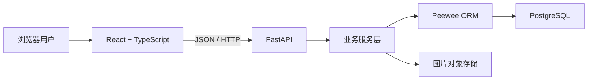
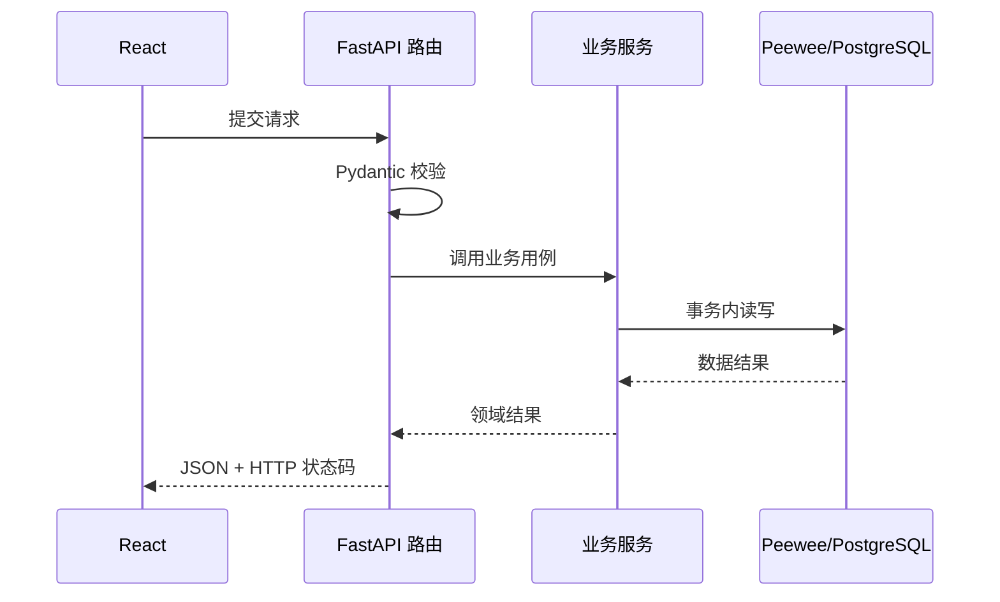
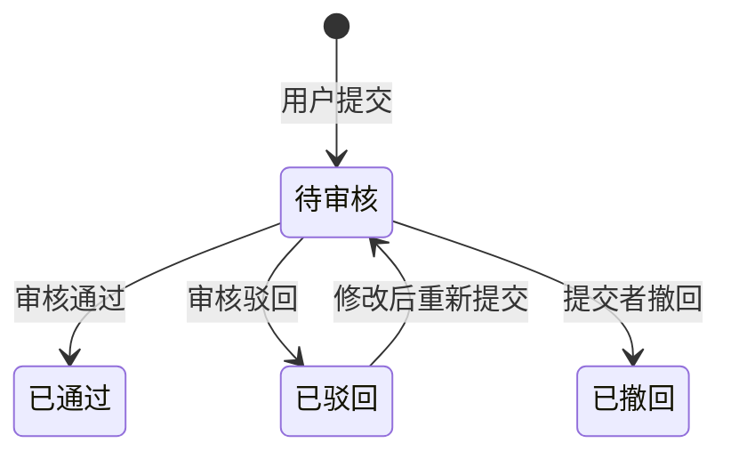

# 电赛白皮书技术架构设计

> 状态：V0.1  
> 目标：为 MVP 提供清晰、可学习、可逐步扩展的技术基础

## 1. 架构目标

本项目采用前后端分离的单体架构。MVP 不引入微服务、消息队列和复杂分布式组件，优先把 HTTP、数据库、认证授权、事务、版本审核和测试等全栈基本功做好。



本地学习阶段允许使用 SQLite 快速启动；进入版本审核功能开发前切换到 PostgreSQL，并以 PostgreSQL 作为正式测试与生产环境。

## 2. 仓库结构

```text
电赛白皮书/
├─ frontend/                 React 前端
├─ backend/                  FastAPI 后端
│  ├─ app/
│  │  ├─ api/               HTTP 路由
│  │  ├─ core/              配置、安全等基础能力
│  │  ├─ db/                数据库连接
│  │  ├─ models/            Peewee 数据模型
│  │  ├─ schemas/           Pydantic 请求与响应模型
│  │  ├─ services/          业务规则与事务
│  │  └─ main.py            应用入口
│  └─ tests/                后端测试
├─ docs/                     架构与学习文档
├─ PRD.md
└─ README.md
```

## 3. 前端架构

### 3.1 技术选择

- React + TypeScript：页面与组件。
- Vite：开发服务器和构建。
- React Router：页面路由。
- TanStack Query：接口数据、缓存和请求状态。
- Tiptap/ProseMirror：后续实现结构化富文本和文本锚点。
- 原生 CSS 变量起步，形成设计令牌后再决定是否引入组件库。

### 3.2 页面模块

- 公共区：首页、故障现象、搜索、条目阅读、公开版本历史。
- 用户区：登录注册、提交条目、提交修改、收藏、通知、我的贡献。
- 审核区：审核队列、版本差异、通过与驳回。
- 管理区：举报、用户、标签分类和审计日志。

### 3.3 状态边界

- 组件内部交互使用 React 本地状态。
- 服务端数据使用 TanStack Query，不复制进全局状态。
- 登录用户信息只保留必要字段；认证凭据优先使用安全 Cookie。
- 编辑器草稿单独管理并定期保存，避免与已发布正文混淆。

## 4. 后端架构

### 4.1 分层职责

| 层 | 负责内容 | 不负责内容 |
| --- | --- | --- |
| API 路由 | 参数接收、依赖注入、状态码 | 复杂业务规则 |
| Schema | 输入校验、输出结构 | 数据库查询 |
| Service | 审核、权限、版本、事务 | HTTP 表现形式 |
| Model | 表结构、关系、基础查询 | 跨模块流程 |
| Core/DB | 配置、认证、连接生命周期 | 具体产品业务 |

### 4.2 请求流程



### 4.3 同步数据库策略

Peewee 是同步 ORM。MVP 的数据库路由优先使用 FastAPI 普通 `def` 路由，让框架在线程池中执行；不在 `async def` 中直接执行同步数据库查询。只有真正需要异步 I/O 的功能才使用异步接口。

## 5. 核心领域模型

### 5.1 账号与权限

- `User`：用户名、密码哈希和角色。
- `AuthSession`：登录会话的哈希令牌与过期时间。
- MVP 只有贡献者和审核员两种角色。第一位注册用户自动成为审核员，后续用户是贡献者；部署公开注册前改为初始化命令创建审核员。

### 5.2 条目与版本

- `Symptom` 是故障现象入口。
- `ArticleRevision` 保存正文快照、作者和审核状态。
- 修改提交不会覆盖当前公开内容。
- 审核通过时，在同一事务内将旧公开版本标记为历史版本，并发布新版本。
- 驳回保留版本与审核意见，便于提交者学习和再次修改。



### 5.3 划线评论

评论线程绑定：

- 条目 ID
- 创建时版本 ID
- 选中文本
- 前后文
- 结构化文档位置
- 评论状态

正文更新后先精确匹配原文和上下文，无法可靠定位时显示“原文已变更”，不能猜测性绑定到错误段落。

## 6. API 约定

- API 前缀：`/api/v1`
- 成功响应直接返回资源或分页结构。
- 参数错误使用 `422`。
- 未登录使用 `401`，权限不足使用 `403`。
- 资源不存在使用 `404`。
- 编辑基线冲突使用 `409`。
- 审核通过等改变状态的操作必须在事务内完成。
- 所有时间以 UTC 存储，前端按用户时区显示。

## 7. 身份认证

MVP 使用用户名和密码：

1. 注册时校验用户名唯一性。
2. 密码使用 PBKDF2-SHA256 加盐哈希，不保存明文或可逆密文。
3. 登录成功后使用 HttpOnly、SameSite Cookie 保存随机会话令牌；生产环境启用 Secure。
4. 修改密码、封禁用户和退出登录后可撤销会话。
5. 审核与管理接口同时检查登录身份和角色权限。

认证实现前需要完成威胁检查和测试，不自行发明加密算法。

## 8. 数据库与迁移

- 本地第一阶段：SQLite，帮助理解表、查询和 ORM。
- 核心业务阶段：PostgreSQL，验证事务、并发、索引和全文检索。
- 每次表结构变化都通过迁移文件完成。
- 版本审核操作使用数据库事务。
- 用户名、邮箱、版本状态、外键和常用排序字段建立适当索引。
- 测试数据库与开发数据库隔离。

## 9. 图片存储

- 数据库只保存图片元数据和对象键，不把图片二进制放入数据库。
- 服务端校验实际文件类型、大小和图片内容。
- MVP 允许 JPG、PNG、WebP，单张不超过 10 MB。
- 本地阶段保存到受控目录；部署后切换到兼容 S3 的对象存储。
- 原图和网页展示图使用不同对象键，避免覆盖历史引用。

## 10. 测试策略

- 单元测试：服务层的审核、权限和锚点规则。
- API 测试：状态码、输入校验和权限边界。
- 数据库测试：事务、唯一约束、版本冲突。
- 前端测试：关键组件和表单交互。
- 端到端测试：注册、提交、审核、阅读、评论完整流程。

每个功能遵循“先明确验收条件，再实现，再验证”的节奏。

## 11. 部署演进

### 阶段一：本地可运行

- React 开发服务器。
- FastAPI 开发服务器。
- SQLite。

### 阶段二：接近生产

- PostgreSQL。
- 前后端环境变量。
- 数据库迁移。
- 图片对象存储。
- 自动化测试。

### 阶段三：公开部署

- 前端静态托管。
- FastAPI 应用服务。
- 托管 PostgreSQL。
- HTTPS、域名、日志、错误追踪和备份。

正式选择部署平台前，再结合预算、备案要求和主要用户所在地区决定。
